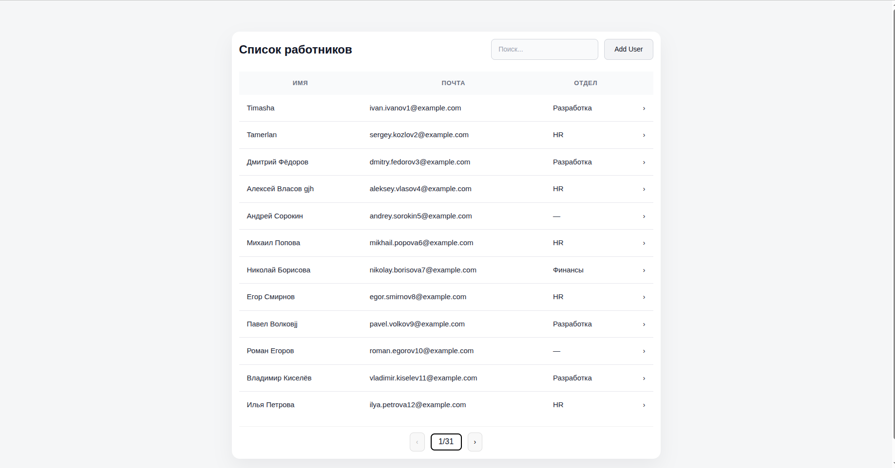
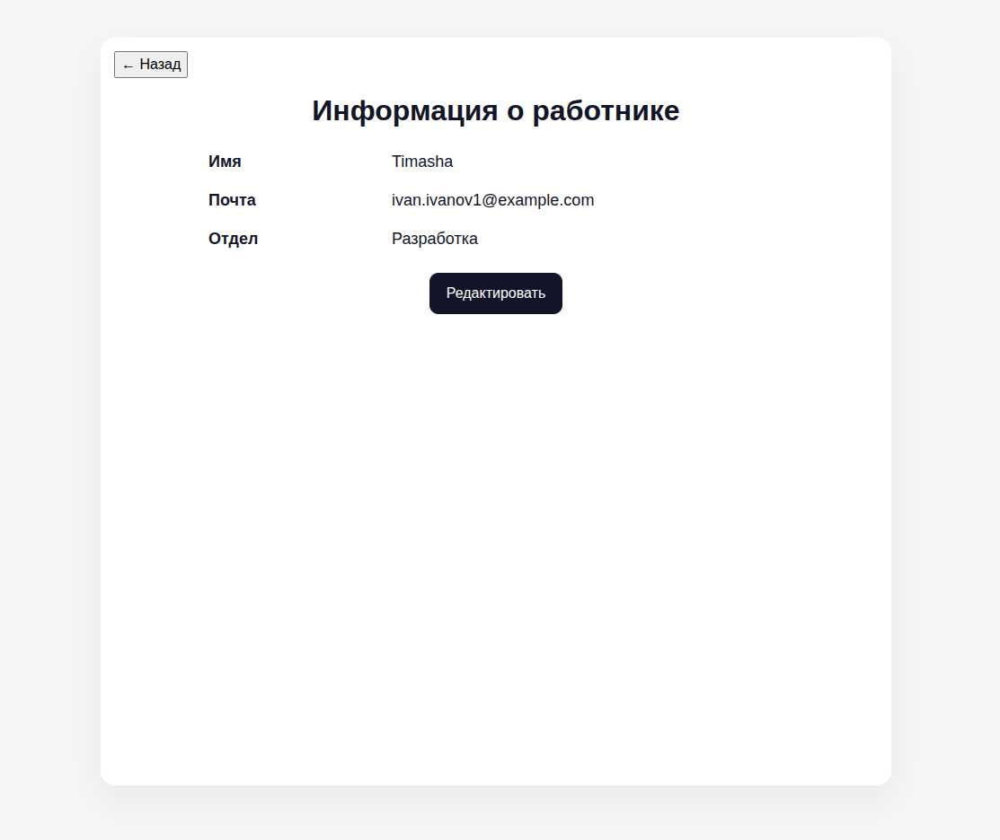
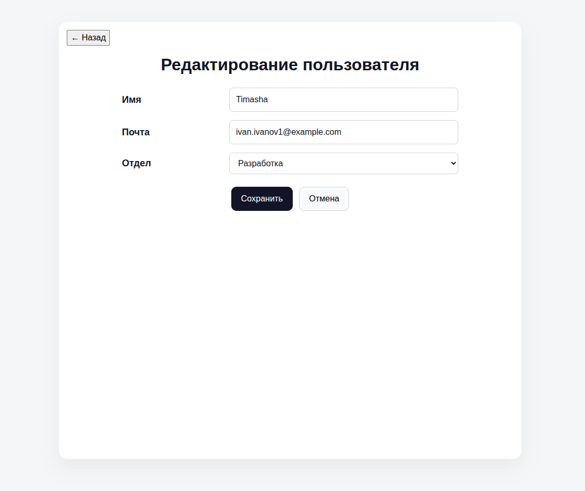
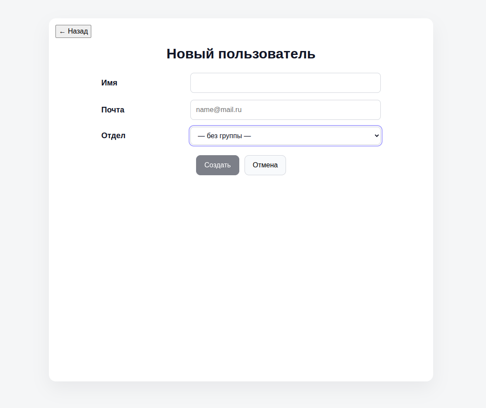

# Список работников — Frontend + API

SPA на React (Vite) + API на Node.js/SQLite.  
Поиск/сортировка/пагинация выполняются **на сервере**.

---

## 1) Как развернуть локально (Frontend)

**Требования:** Node 18+ (или 20+), npm.

```bash
# 1. установить зависимости
npm i
# 2. запустить dev
npm run dev

```

> Если у вас локальный сервер с API, замените `VITE_API` на свой, например `http://localhost:3001`.

---

## 2) Резервное копирование и восстановление БД (без UI)

Есть два способа.

### Способ A — запустить **удалённые** команды прямо из локального проекта (не рекомендую, так придется вводить пароль несколько раз)

Скрипты уже лежат в `scripts/`:

* `npm run backup:remote` — сделать бэкап на сервере;
* `npm run backup:remote:pull` — сделать бэкап и скачать файл в `./server/backup.json`;
* `npm run restore:remote` — восстановить БД на сервере:

  * из файла, который **уже лежит** на сервере (`backup.json`);
  * или передать **локальный файл** как аргумент, он загрузится и применится:

    ```bash
    npm run restore:remote -- ./server/backup.json
    ```

Скрипты читают конфиг из `.remote.env` в корне проекта:

```env
# VPS
REMOTE_HOST=5.129.215.232
REMOTE_USER=root
REMOTE_PORT=22
REMOTE_DIR=/root/server

# опционально
BACKUP_FILE=backup.json
PM2_NAME=users-api
```

> Примечание: `ssh`/`scp` могут **несколько раз** спросить пароль (scp + 1–2 ssh-сессии) — это нормально.  
> Чтобы не вводить пароль: `ssh-copy-id -p 22 root@5.129.215.232`.

---

### Способ B — зайти на сервер и выполнить команды там
 
>
> **Server:** `5.129.215.232`  
> **Login:** `root`  
> **Password:** `n7Hi-,TcWovCfL`

```bash
ssh root@5.129.215.232 -p 22
cd /root/server

# сделать бэкап (создаст /root/server/backup.json)
npm run backup

# восстановить из backup.json
npm run restore

# (если после restore API остановлен)
pm2 start users-api
```

Бэкап/рестор работают через скрипты `backup.js` / `restore.js` (SQLite).  
Если после restore таблица пуста, проверьте размер `backup.json` и логи restore:

```bash
node restore.js backup.json
sqlite3 users.db 'select count(*) from users;'
```

---

## 3) API — краткая документация

Базовый URL берётся на фронте из `VITE_API`. В темринале прописываете данную команду:

```bash
API=http://5.129.215.232:3001
```

### `GET /users`

Серверная пагинация/поиск/сортировка.

**Query-параметры:**

* `page` — номер страницы (>=1), по умолчанию `1`
* `pageSize` — размер страницы (1..100), по умолчанию `12`
* `search` — строка поиска (по `name`, `email`, `group`)
* `sortBy` — `name` | `email` | `group`
* `sortDir` — `asc` | `desc`

**Пример:**

```bash
curl "$API/users?page=1&pageSize=5&search=ivan&sortBy=name&sortDir=asc"
```

**Ответ:**

```json
{
  "items":[{"id":1,"name":"...","email":"...","group":"..."}],
  "page":1,"pageSize":12,"total":360,"totalPages":30,
  "sortBy":"name","sortDir":"asc","search":"ivan"
}
```

---

### `GET /users/:id`

Карточка сотрудника.

```bash
curl "$API/users/123"
```

Коды: `200`, `404 { "error": "NOT_FOUND" }`.

---

### `POST /users`

Создание сотрудника.

```bash
curl -X POST "$API/users"   -H 'Content-Type: application/json'   -d '{"name":"Иван Петров","email":"ivan.petrov@example.com","group":"HR"}'
```

Коды:

* `201` (возвращает созданного пользователя),
* `400 { "error": "VALIDATION" }` — если пустые поля,
* `409 { "error": "EMAIL_EXISTS" }` — если e-mail уже занят.

---

### `PATCH /users/:id`

Редактирование любого подмножества полей (`name|email|group`).

```bash
curl -X PATCH "$API/users/123"   -H 'Content-Type: application/json'   -d '{"group":"Маркетинг"}'
```

Коды:  
`200`, `400 { "error": "EMPTY_PATCH" }`, `404 { "error": "NOT_FOUND" }`, `409 { "error": "EMAIL_EXISTS" }`.

---

### `DELETE /users/:id` *(если включено на сервере)*

Удаление сотрудника.

```bash
curl -i -X DELETE "$API/users/123"
```

Коды: `204`, `404`.

---

### `GET /groups`

Список уникальных отделов (без `null`).

```bash
curl "$API/groups"
# ["HR","Финансы","Разработка", ...]
```

---

## 4) Частые вопросы

* **Кнопка «Создать/Сохранить» неактивна** — проверьте, что поле «Имя» не пустое, а в «Почта» есть `@`.  
  Под полем «Почта» выводится подсказка «Формат: имя@домен».

* **Поиск по русским буквам** — на сервере включена нормализация регистра (или «теневые» поля), поэтому запросы в любом регистре (иван/ИВАН) должны находить совпадения. Если это отключить — SQLite по умолчанию сравнивает без учёта регистра только ASCII.

* **Скрипты бэкапа 2–3 раза просят пароль** — это ожидаемо: `scp` + несколько `ssh` подключений. Чтобы убрать запросы, делайте бэкап прям на сервере.

---

## 5) Команды для разработчика (локально)

```bash
# dev-сервер фронтенда
npm run dev

# прод-сборка и предпросмотр
npm run build
npm run preview

# бэкап на VPS
npm run backup:remote
# бэкап + скачать локально
npm run backup:remote:pull
# восстановить из локального файла
npm run restore:remote -- ./server/backup.json
```

---

## 6) Структура проекта

```
project/
├─ src/                     # фронт
│  ├─ components/           # CreateUser, UserDetails, UsersList
│  ├─ hooks/usePath.js      # мини-роутер без библиотек
│  ├─ services/users.js     # обёртки над API
│  ├─ App.jsx, App.css, main.jsx, index.css
├─ scripts/                 # локальные скрипты для удалённого бэкапа/рестора
│  ├─ backup-remote.sh
│  └─ restore-remote.sh
├─ .env.local               # VITE_API=...
├─ .remote.env              # REMOTE_HOST/USER/... (не коммитить в публичный репо)
└─ package.json
```
---


---
## 📸 Скриншоты








---
